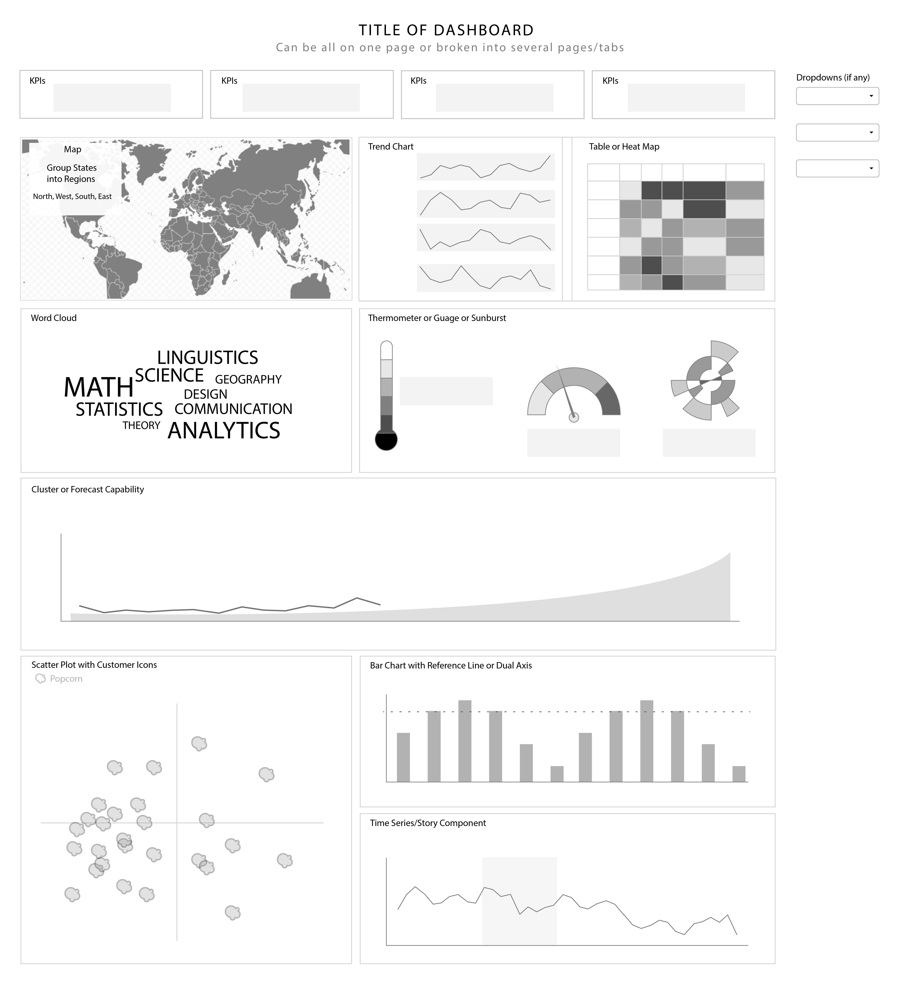

# pyDataVizDay
A python implementation of the Data Viz Day visualization.  The visualization is
built using a flask web framework to serve the web page.  The visualization is 
currently running on [heroku](http://pydatavizday.herokuapp.com/).  


## Developing the visualization
If you want to run the visualization yourself, and further develop it clone this
repo and run the pyDataVizDay.py file.

```
git clone https://github.com/WaylonWalker/pyDataVizDay.git
python src//pyDataVizDay.py
```

## Dataset
This project will be using the Kaggle 
[IMDB 5000 Movie Dataset](https://www.kaggle.com/deepmatrix/imdb-5000-movie-dataset).  It is a collection of 5000 movie metadata pulled from the IMDB website.  It contains

### first 5 rows of data

|    | color   | director_name     |   num_critic_for_reviews |   duration |   director_facebook_likes |   actor_3_facebook_likes | actor_2_name     |   actor_1_facebook_likes |         gross | genres                          | actor_1_name    | movie_title                                |   num_voted_users |   cast_total_facebook_likes | actor_3_name         |   facenumber_in_poster | plot_keywords                                                    | movie_imdb_link                                      |   num_user_for_reviews | language   | country   | content_rating   |     budget |   title_year |   actor_2_facebook_likes |   imdb_score |   aspect_ratio |   movie_facebook_likes |
|----|---------|-------------------|--------------------------|------------|---------------------------|--------------------------|------------------|--------------------------|---------------|---------------------------------|-----------------|--------------------------------------------|-------------------|-----------------------------|----------------------|------------------------|------------------------------------------------------------------|------------------------------------------------------|------------------------|------------|-----------|------------------|------------|--------------|--------------------------|--------------|----------------|------------------------|
|  0 | Color   | James Cameron     |                      723 |        178 |                         0 |                      855 | Joel David Moore |                     1000 |   7.60506e+08 | Action/Adventure/Fantasy/Sci-Fi | CCH Pounder     | Avatar                                     |            886204 |                        4834 | Wes Studi            |                      0 | avatar/future/marine/native/paraplegic                           | http://www.imdb.com/title/tt0499549/?ref_=fn_tt_tt_1 |                   3054 | English    | USA       | PG-13            |   2.37e+08 |         2009 |                      936 |          7.9 |           1.78 |                  33000 |
|  1 | Color   | Gore Verbinski    |                      302 |        169 |                       563 |                     1000 | Orlando Bloom    |                    40000 |   3.09404e+08 | Action/Adventure/Fantasy        | Johnny Depp     | Pirates of the Caribbean- At World's End   |            471220 |                       48350 | Jack Davenport       |                      0 | goddess/marriage ceremony/marriage proposal/pirate/singapore     | http://www.imdb.com/title/tt0449088/?ref_=fn_tt_tt_1 |                   1238 | English    | USA       | PG-13            |   3e+08    |         2007 |                     5000 |          7.1 |           2.35 |                      0 |
|  2 | Color   | Sam Mendes        |                      602 |        148 |                         0 |                      161 | Rory Kinnear     |                    11000 |   2.00074e+08 | Action/Adventure/Thriller       | Christoph Waltz | Spectre                                    |            275868 |                       11700 | Stephanie Sigman     |                      1 | bomb/espionage/sequel/spy/terrorist                              | http://www.imdb.com/title/tt2379713/?ref_=fn_tt_tt_1 |                    994 | English    | UK        | PG-13            |   2.45e+08 |         2015 |                      393 |          6.8 |           2.35 |                  85000 |
|  3 | Color   | Christopher Nolan |                      813 |        164 |                     22000 |                    23000 | Christian Bale   |                    27000 |   4.48131e+08 | Action/Thriller                 | Tom Hardy       | The Dark Knight Rises                      |           1144337 |                      106759 | Joseph Gordon-Levitt |                      0 | deception/imprisonment/lawlessness/police officer/terrorist plot | http://www.imdb.com/title/tt1345836/?ref_=fn_tt_tt_1 |                   2701 | English    | USA       | PG-13            |   2.5e+08  |         2012 |                    23000 |          8.5 |           2.35 |                 164000 |
|  4 | nan     | Doug Walker       |                      nan |        nan |                       131 |                      nan | Rob Walker       |                      131 | nan           | Documentary                     | Doug Walker     | Star Wars: Episode VII - The Force Awakens |                 8 |                         143 | nan                  |                      0 | nan                                                              | http://www.imdb.com/title/tt5289954/?ref_=fn_tt_tt_1 |                    nan | nan        | nan       | nan              | nan        |          nan |                       12 |          7.1 |         nan    |                      0 |


## Interactivity

The viz should include the following interactive features if time allows

* Filters
* Tooltips
* Drill-down ability
* Export the data
* Animation

## Modeling

The viz should include the following modeling techniques if time allows

* Clustering
* Trend and Forecasting
* Regression & Correlation
* Percentiles
* Natural Language Processing
* Reference Lines

## Wireframe

This is the wireframe that the team has been given to replicate in python using any technique they wish to use.




## Time Investment

* **5 min** ETL
    * initial creation(modified personal file)
* **5 min** settings.py
    * 5 minute (modified personal file)
* **20 min** setup initial layout.html, index, and first two "story".html pages
    * found decent bootstrap layout template online
    * first time following the Flask Active button tutorial
    * http://jinja.pocoo.org/docs/2.9/tricks/
* **10 min** setup heroku repo and build environment
* **30 min** debug initial heroku deployment
* **15 min** added reveal slide template
* **45 min** update etl
    * split keyword/genre into rows
    * define update method
    * docstrings
    * add keyword/genre to load method
    
